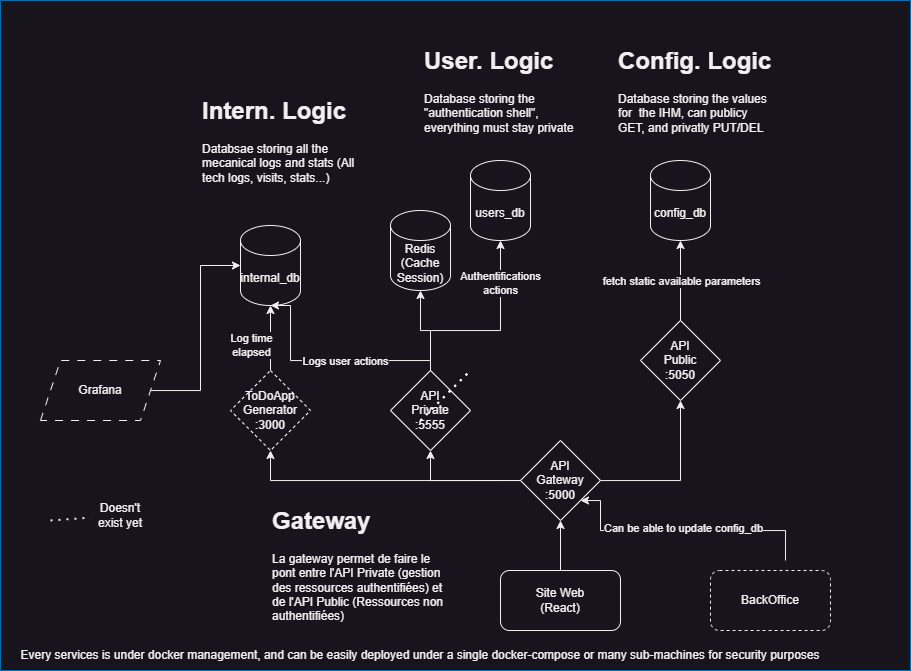

# Compte Rendu 1 - Éric PHILIPPE / Luca STRAPUTICARI

## Sommaire

- [🚀 TodoApp Generator](#-todoapp-generator)
  - [✨ Fonctionnalités Principales](#-fonctionnalités-principales)
    - [🔧 Configuration Backend](#-configuration-backend)
    - [🎨 Configuration Frontend](#-configuration-frontend)
    - [🛠️ Options Avancées](#-options-avancées)
- [Comment lancer le projet ?](#comment-lancer-le-projet-)
- [Architecture](#architecture)
- [Choix architecturaux](#choix-architecturaux)

## 🚀 TodoApp Generator

Générez votre application TodoList complète en quelques clics. Vous en avez assez de passer des heures à refaire encore et encore la même TodoList ?

TodoApp Generator est un outil web qui automatise la création d'applications TodoList complètes avec votre stack technique préférée. Inspiré par Spring Initializr, il permet de générer rapidement un projet FullStack prêt à l'emploi avec les meilleures pratiques intégrées.

> Pourquoi ? Après avoir développé des dizaines de TodoList au cours de mes études, j'en ai eu assez de perdre du temps à refaire la même chose. J'ai donc créé cet outil pour automatiser la génération de TodoList avec les technologies que j'aime.

### ✨ Fonctionnalités Principales

#### 🔧 Configuration Backend

•Langages supportés : Node.js, Python (FastAPI), Java (Spring Boot), C# (.NET), Go (Gin), PHP (Laravel)
•Architectures : MVC, Clean Architecture, Hexagonal, Layered, Microservices
•Bases de données : SQLite, PostgreSQL, MySQL, MongoDB, Redis

#### 🎨 Configuration Frontend

•Types d'applications : MVP (templates serveur), SPA, SSR
•Frameworks : React, Vue.js, Angular, Svelte, Next.js, Nuxt.js
•Styling : Tailwind CSS, Bootstrap, Material UI, Chakra UI, CSS Vanilla

#### 🛠️ Options Avancées

•✅ Authentification utilisateur (JWT, sessions)
•✅ Tests unitaires préconfigurés
•✅ Docker Compose pour environnement complet
•✅ CI/CD avec GitHub Actions
•✅ Documentation API automatique (Swagger/OpenAPI)

## Comment lancer le projet ?

Accéder à la section "Démarrage rapide" en dev dans le fichier [README.md](../README.docker.md) pour les instructions détaillées.

## Architecture

## Choix architecturaux

### 🔒 Authenticated Logic — Gestion des utilisateurs et des sessions

La séparation de la logique des services authentifiés dans un service dédié permet de concentrer les traitements sensibles liés à ce dernier, la gestion des comptes et la validation des droits d’accès. La base de données users_db stocke les informations critiques (identifiants, statuts, abonnements, etc.) de manière sécurisée. L'utilisation de Redis comme cache pour les sessions permet une validation rapide des tokens et un suivi efficace des sessions utilisateurs, tout en soulageant la base principale. L'API Privée (API Private), développée en Go avec Gin, permet un typage strict, une gestion des erreurs robuste et une performance optimale pour ces opérations critiques.

### 📊 Intern Logic — Logs, métriques et observabilité

Le service interne gère toute la mécanique de logs techniques, de visites et de statistiques métier. Il s’interface avec une base internal_db centralisant les traces utiles à la supervision de la plateforme. Le ToDoApp Generator, écrit en Go, est intégré ici pour des raisons de performances et de concurrence native du langage. En effet, la génération de projets ou de structures techniques peut être fortement parallélisée et bénéficier de la compilation binaire rapide et portable de Go.

### ⚙️ Config Logic — Paramètres dynamiques pour l’IHM

Le service de configuration expose des paramètres publics ou semi-publics consommés par l’IHM. La base config_db permet d’interroger ou de modifier dynamiquement des éléments tels que les technologies proposées, les options de configuration utilisateur ou des variables d’interface. L’API Publique, en TypeScript/Express, est simplement ouverte à la lecture (GET) pour permettre à l’interface d’afficher rapidement les options disponibles.

### 🌐 Frontend — Interface web moderne et dynamique

L’IHM est développée en React, un framework moderne adapté à la construction d’interfaces dynamiques, maintenables et performantes. Il permet une expérience utilisateur fluide, notamment grâce à la gestion fine du DOM virtuel. Ce choix est cohérent avec l’architecture en microservices : React permet une intégration facile avec des APIs RESTful, une séparation claire entre logique et interface, et facilite la montée en charge de l’application côté client.

### 🧩 API Gateway — Entrée unique et sécurité centralisée

Le API Gateway centralise toutes les requêtes du frontend. Il permet de gérer l’authentification, le routing conditionnel, la limitation de débit, et de centraliser la journalisation. Ce composant est fondamental pour découpler le frontend des microservices sous-jacents, et pour implémenter des règles de sécurité transverses. Il garantit également l’extensibilité future, en permettant l’ajout de services ou d’APIs sans impacter les clients existants.

### Conclusion

Cette architecture modulaire assure une séparation claire des responsabilités, facilitant la maintenance, la scalabilité et la sécurité. Go Et TypeScript pour les APIs garantissent robustesse et cohérence, Go optimise les performances du générateur et de l'API Private. React côté frontend offre une interface fluide et réactive, idéale pour interagir avec des microservices. Le tout est conteneurisé pour un déploiement flexible, en local ou distribué.
